<h1 align="center">react-native-nitro-rolling-number</h1>

<p align="center">
  A native <b>rolling number</b> for React Native. Every digit is a wheel that rolls, driven by one C++ engine on iOS and Android.<br/>
  Built with <a href="https://nitro.margelo.com">Nitro Modules</a>.
</p>

<p align="center">
  <a href="https://ronickg.github.io/react-native-nitro-rolling-number/"><b>Docs &amp; live demos</b></a> ·
  <a href="https://ronickg.github.io/react-native-nitro-rolling-number/rolling-number/reveal">Jackpot reveal</a> ·
  <a href="https://ronickg.github.io/react-native-nitro-rolling-number/rolling-number/benchmarks">Benchmarks</a> ·
  <a href="packages/react-native-nitro-rolling-number/README.md">Package README</a>
</p>

<p align="center">
  
</p>

<p align="center"><sub>The example app's market showcase on an iPhone 13 Pro Max (left) and a Pixel 10 (right): fourteen coins with price and 24 h change, a handful ticking every 200 ms, the balance derived from them. Every number is native.</sub></p>

## Why

- **Native on both platforms.** A `value` change is one JSI call; the roll runs on a `CADisplayLink` (Core Animation layers) or a `Choreographer` (Canvas). A busy JS thread never delays an animation in flight.
- **Every digit is a wheel.** Shortest path in the direction of the change, columns sliding in and out as the number grows, easing, spring or a cascading stagger.
- **Money-ready.** Fraction digits, grouping and decimal separators, a currency symbol or code at its own size pinned to the top or bottom of the digits, zero padding, negatives.
- **Fits its box.** Auto-sizes to its content, or shrinks continuously to a fixed width without squeezing digits still on their way out.
- **Jackpot reveal.** The casino win-meter rollup (tiers that punch and hold, a figure that grows as it climbs) and the slot-reel reveal, all native.
- **Loading, accessible, recyclable.** A text-shaped shimmer while the value loads, VoiceOver / TalkBack read the formatted amount, Reduce Motion snaps, Fabric can recycle it in long lists.

## Install

```sh
bun add react-native-nitro-rolling-number react-native-nitro-modules
cd ios && pod install
```

React Native 0.78+ with the new architecture, Nitro Modules 0.37+.

## Use

```tsx
import { RollingNumber } from 'react-native-nitro-rolling-number'

<RollingNumber
  value={balance}
  fractionDigits={2}
  groupingSeparator=","
  prefix="$"
  prefixFontSize={24}
  affixAlign="top"
  fontSize={48}
  fontWeight="800"
  easing="spring"
  stagger={30}
/>
```

Change `value` and the digits roll. `ref.current.jumpTo(v)` positions the wheels continuously for scrubbing, `animateTo(v)` rolls, `revealTo(v)` plays a jackpot reveal.

## Jackpot reveal

<p align="center">
  
</p>

```tsx
<RollingNumber
  value={50000}
  reveal={reveal}                        // false holds "$0.00", true plays
  revealStyle="count"                    // or "spin" for slot reels
  revealMilestones={[1000, 10000, 25000]}
  revealMilestoneHold={400}
  revealDuration={4800}                  // about a second per tier
  onRevealMilestone={(index, at) => haptics.impact()}
  onRevealEnd={() => setShowNextStep(true)}
  prefix="$" fractionDigits={2} groupingSeparator="," textAlign="center" style={{ width: '100%' }}
/>
```

The count follows how slot machines present a win: a constant-rate tally per tier that winds up out of each milestone and crawls into the next, a figure that opens smaller and grows as it climbs, and punches that settle without dipping under the resting size. `jumpTo(value)` skips (tap to slam). Banners, confetti and sounds stay in the app: the callbacks give you the beats. [Guide →](https://ronickg.github.io/react-native-nitro-rolling-number/rolling-number/reveal)

## Performance

Release builds on real phones, 24 copies fed a new value on every frame, frames per second the UI thread delivered and how many it missed in five seconds (the JS thread is the other half of the story: see the full tables):

<picture>
  <source media="(prefers-color-scheme: dark)" srcset="docs/static/img/bench/glance-dark.svg">
  
</picture>

| | iPhone 13 Pro Max (120 Hz) | iPhone 11 Pro (60 Hz) | Galaxy A22 (90 Hz, low-end) |
| --- | --- | --- | --- |
| **Nitro Rolling Number** (`value` prop) | 120 fps (0 dropped) | 59.9 fps (0 dropped) | 90.4 fps (0 dropped) |
| **Nitro Rolling Number** (`jumpTo`) | 120 fps (0 dropped) | 59.9 fps (0 dropped) | 89.8 fps (3 dropped) |
| react-native-number-animation (native) | 117 fps (13 dropped) | 59.1 fps (4 dropped) | 56.2 fps (170 dropped) |
| react-native-animated-rolling-numbers | 117 fps (17 dropped) | 58.7 fps (5 dropped) | 18.8 fps (370 dropped) |
| NumberFlow (View) | 76.1 fps (222 dropped) | 49.1 fps (56 dropped) | 24.9 fps (352 dropped) |
| NumberFlow (Skia) | 86.7 fps (182 dropped) | 53.1 fps (37 dropped) | 28.2 fps (309 dropped) |
| react-native-number-bloom | 64.8 fps (281 dropped) | 48.3 fps (60 dropped) | 49.5 fps (207 dropped) |
| react-native-animated-numbers | 116 fps (21 dropped) | 56.7 fps (16 dropped) | 51.2 fps (199 dropped) |
| react-native-ticker | 11.8 fps (544 dropped) | 7.6 fps (258 dropped) | 12.6 fps (379 dropped) |

Method, the JS-thread and CPU columns, the ten-a-second and one-copy cases, a scrolling list, mount cost and the Instruments cross-check: [BENCHMARKS.md](BENCHMARKS.md); the same tables as charts you can hover and switch between metrics: [the benchmark pages of the docs](https://ronickg.github.io/react-native-nitro-rolling-number/rolling-number/benchmarks).

## Also in this repo: a morphing input

[`react-native-nitro-input`](packages/react-native-nitro-input) is a native single-line **text and amount input** whose text morphs as you type, the way [Torph](https://torph.lochie.me) morphs text on the web: characters that stay glide to their new place, new ones slide or fade in, removed ones leave with their neighbours. A system text field owns the keyboard, editing, selection and accessibility; in `mode="number"` every keystroke is formatted on the native side before a frame is drawn (grouping, decimals, a currency prefix or suffix, the caret kept in place), so there is no JS round trip and none of the flicker of a `TextInput` formatted in `onChangeText`. With `react-native-worklets` installed, a `transform` worklet and worklet change handlers run on the UI thread inside the edit, for masks written in JS and shared values updated before the next frame.

```tsx
import { NitroInput } from 'react-native-nitro-input'

<NitroInput mode="number" prefix="$" prefixFontSize={28} affixAlign="top" placeholder="0" fontSize={48} fontWeight="700" textAlign="center" style={{ width: '100%' }} onChangeValue={setAmount} />
```

[Guide and live demo →](https://ronickg.github.io/react-native-nitro-rolling-number/input) · [Package README](packages/react-native-nitro-input/README.md)

Typed into at eight keys a second by the benchmark probe, the way a keyboard types: how many of 12 keys were rewritten a frame later (the flicker of formatting in JavaScript), how long a key took to settle at p95, and JavaScript per key:

| | iPhone 13 Pro Max | iPhone 11 Pro | Galaxy A22 |
| --- | --- | --- | --- |
| **NitroInput** (`mode="number"`) | 0 of 12 keys, 0 ms, JS 1 ms/key | 0 of 12 keys, 0 ms, JS 2 ms/key | 0 of 12 keys, 0 ms, JS 5 ms/key |
| **MorphInput** (`mode="number"`) | 0 of 12 keys, 0 ms, JS 9 ms/key | 0 of 12 keys, 0 ms, JS 9 ms/key | 0 of 12 keys, 0 ms, JS 19 ms/key |
| TextInput + formatting in `onChangeText` | 10 of 12 keys, 50 ms, JS 9 ms/key | 10 of 12 keys, 54 ms, JS 10 ms/key | 10 of 12 keys, 77 ms, JS 47 ms/key |
| react-native-currency-input | 10 of 12 keys, 67 ms, JS 10 ms/key | 10 of 12 keys, 55 ms, JS 11 ms/key | 10 of 12 keys, 67 ms, JS 48 ms/key |
| react-native-mask-input | 10 of 12 keys, 67 ms, JS 10 ms/key | 10 of 12 keys, 66 ms, JS 11 ms/key | 10 of 12 keys, 66 ms, JS 41 ms/key |
| TextInput (plain, no formatting) | 0 of 12 keys, 0 ms, JS 6 ms/key | 0 of 12 keys, 0 ms, JS 8 ms/key | 0 of 12 keys, 0 ms, JS 22 ms/key |

Full tables, focus latency and mount cost: [BENCHMARKS.md](BENCHMARKS.md#the-inputs).

## Repository

- [`packages/react-native-nitro-rolling-number`](packages/react-native-nitro-rolling-number) – the rolling number: the shared C++ engine (`cpp/`), the Swift and Kotlin views, the Nitro spec and the JS wrapper. Its [README](packages/react-native-nitro-rolling-number/README.md) is the API reference.
- [`packages/react-native-nitro-input`](packages/react-native-nitro-input) – the morphing input, same layout: `cpp/MorphEngine` + `cpp/AmountFormatter`, a Swift and a Kotlin view around a hidden system text field.
- [`example/`](example) – React Native 0.87 app with every demo, the benchmark harness and the showcase screens the recordings come from. Its [`__tests__/*.harness.tsx`](example/__tests__) are on-device suites run by [React Native Harness](https://www.react-native-harness.dev) inside the app (see [`example/__tests__/README.md`](example/__tests__/README.md)); CI runs them on an Android emulator and an iOS simulator.
- [`docs/`](docs) – the Docusaurus site. Its live demos run the very same `RollingEngine.cpp` and `MorphEngine.cpp`, compiled to WebAssembly.
- [`scripts/bench`](scripts/bench) – the device benchmarks behind [BENCHMARKS.md](BENCHMARKS.md): `run.mjs` builds, installs and drives the example app on real phones, `report.mjs` renders the tables from `results/`. [`scripts/ui`](scripts/ui) – `recycle-check.mjs` drives the example's "Recycle check" screen through [argent](https://github.com/software-mansion/argent) on a simulator, an emulator or a phone and checks that every row shows and paints the value it should, mid-roll frames included; the release-time check for view recycling.

```sh
bun install                 # hoisted linker, see bunfig.toml
bun specs                   # re-run nitrogen after editing src/specs/*.nitro.ts
bun run test                # jest tests for the JS wrappers (plain `bun test` would run Bun's own runner against them)
bun run test:cpp            # C++ engine tests for both packages (host clang++)
bun run build               # lib/ for both packages: ES modules, CommonJS and declarations
bun example ios             # or: bun example android
bun run test:harness:ios    # on-device suites (example/__tests__/*.harness.tsx) in the example app on a simulator; `:android` for the emulator
node scripts/ui/recycle-check.mjs --udid <device>   # the recycling check, on a device with the example app installed (needs argent)
cd docs && npm install && npm start                                  # docs site
```

Releasing: `bun --cwd packages/<package> release <patch|minor|major>` runs the typecheck, the Jest and engine tests, bumps the version, commits, tags, publishes to npm and creates the GitHub release (needs `npm login` and a `GITHUB_TOKEN`).

The two packages release independently out of one history, so each keeps to its own tags: `v<version>` for the rolling number, `nitro-input-v<version>` for the input. Each `release-it` config pins `tagMatch` to that prefix and `commitsPath` to the package directory, so "the previous release" and "what changed since it" mean this package's, not whichever package was tagged last. A release with no commits touching the package is refused. The GitHub release body is the matching `## <version>` section of the package's own `CHANGELOG.md`, read by `scripts/release/changelog-section.mjs` — write that section before releasing, or the release stops.

The example's Android Gradle files point at the workspace root `node_modules`, and Metro watches the whole repo.

## Known issue: view props on Android

Nitro Modules 0.37 never fills a Hybrid View's raw props on Android from React Native 0.86 on, so `backgroundColor`, `border*`, `opacity`, `transform`, `testID` and the accessibility props you pass to `<RollingNumber>` or `<NitroInput>` are silently ignored there. iOS is unaffected. The fix is filed upstream as [margelo/nitro#1655](https://github.com/margelo/nitro/pull/1655) (issue [#1656](https://github.com/margelo/nitro/issues/1656)); until a Nitro release carries it, apply the patch this repo uses: copy [`patches/react-native-nitro-modules@0.37.1.patch`](patches/react-native-nitro-modules@0.37.1.patch) into your app and register it under `patchedDependencies` in `package.json` (Bun) or with [patch-package](https://github.com/ds300/patch-package) (npm / Yarn).

## Credits

The input's morph is based on [Torph](https://torph.lochie.me) by [Lochie Axon](https://github.com/lochie). Thanks for building it.

## License

MIT
